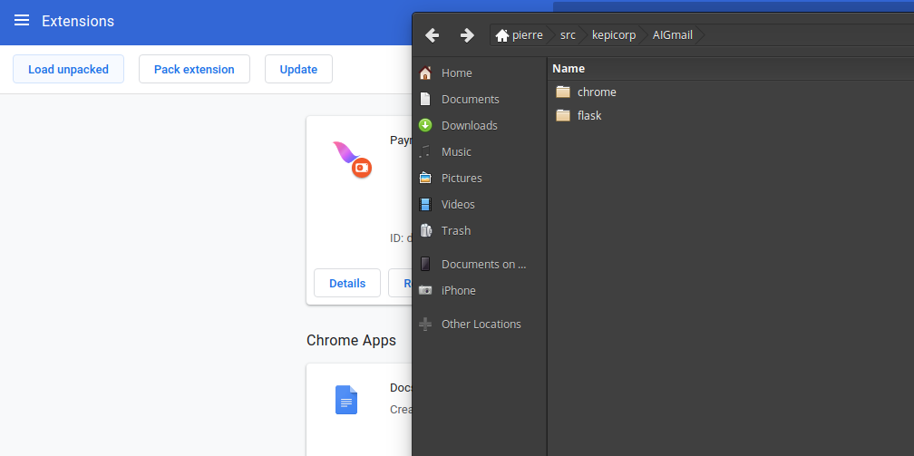
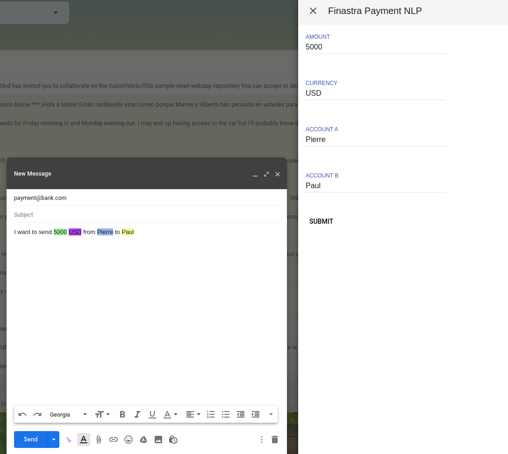

# AI Gmail

## Description

This adds an NLP capability to your gmail account to send payment to GPP.

## Install

### Back-end server

Make sure you have [docker](https://docker.io) installed and [git](https://git-scm.com/downloads).

Clone the repository

> If you already cloned and want to update use ```git pull```

```bash
git clone https://github.com/kepicorp/AIGmail.git
```

Assuming you registered an app at [fusion fabric developer website](https://developer.fusionfabric.cloud), configure your ```client_id```, ```client_secret``` and ```token_endpoint``` in *docker-compose.yml* file

```bash
CLIENT_ID=XXXX
CLIENT_SECRET=YYYY
TOKEN=https://api.fusionfabric.cloud/login/v1/sandbox/oidc/token
```

Run the docker compose

> to build image add ```---build``` at the end of the command line

```bash
docker-compose up
```

The back-end is now running on ```http://localhost:5001```

### Chrome plugin

Go in the extension menu in chrome


And then load unpacked extension by clicking on ```load unpack``` and selecting the ```chrome``` folder in your git repository.

> Make sure you ticked the developer toggle top right



## Usage

Open your gmail account.
Create a new email.
Type in the *body* of the email:
```I want to send 500 USD from AccountA to AccountB```



It should automatically flag everything required.
